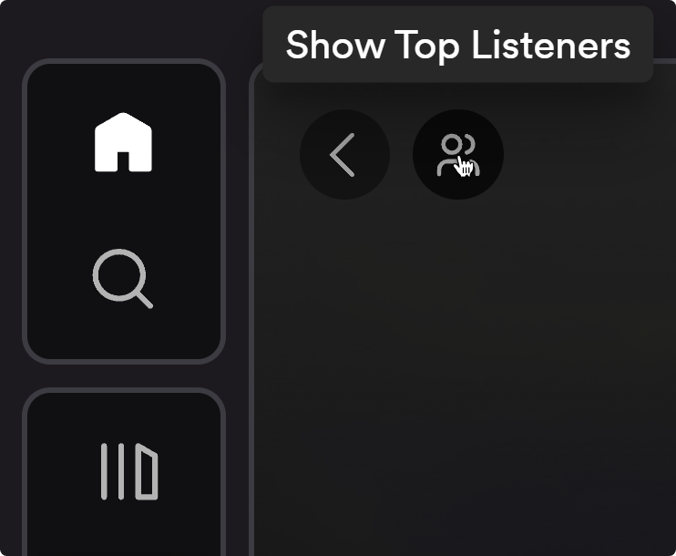
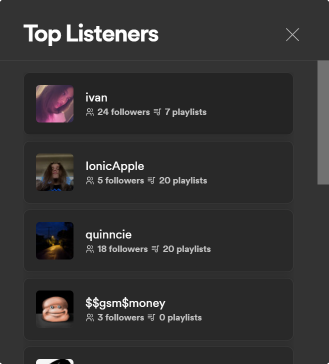

# top-listeners

top-listeners is a [Spicetify](https://github.com/khanhas/spicetify-cli) extension that enables music discovery by showing you the top listeners of the artist you're currently listening to on Spotify. Seeing who the biggest fans are of an artist can help you find similar music tastes and new artist recommendations.

<p align="center">
    
    
</p>

## Install

Copy `top-listeners.js` from the `dist` directory into your [Spicetify](https://github.com/khanhas/spicetify-cli) extensions directory:
| **Platform** | **Path** |
|----------------|--------------------------------------------------------------------------------------|
| **Linux** | `~/.config/spicetify/Extensions` or `$XDG_CONFIG_HOME/.config/spicetify/Extensions/` |
| **MacOS** | `~/spicetify_data/Extensions` or `$SPICETIFY_CONFIG/Extensions` |
| **Windows** | `%appdata%\spicetify\Extensions\` |

```sh
spicetify config extensions top-listeners.js
spicetify apply
```

Or you can manually edit your `config-xpui.ini` file. Add your desired extension filenames in the extensions key, separated them by the | character.
Example:

```ini
[AdditionalOptions]
...
extensions = ...|...|top-listeners.js
```

Then run:

```sh
spicetify apply
```

## Contribute

top-listeners is an open-source project, and contributions are welcome! If you have coding skills or want to contribute in other ways, feel free to get involved. Here's how you can contribute:

1. **Code Contributions:**

   - Fork the repository.
   - Create a new branch for your changes.
   - Make your improvements and submit a pull request.

2. **Bug Reports:**
   - Report any bugs or issues on the [GitHub Issues](https://github.com/notjawad/uni/issues) page.
   - Include detailed information about the problem and steps to reproduce it.
